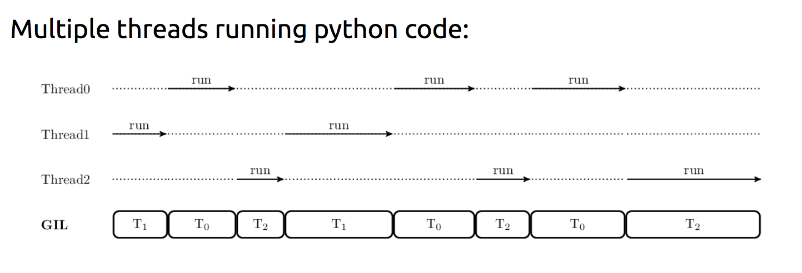
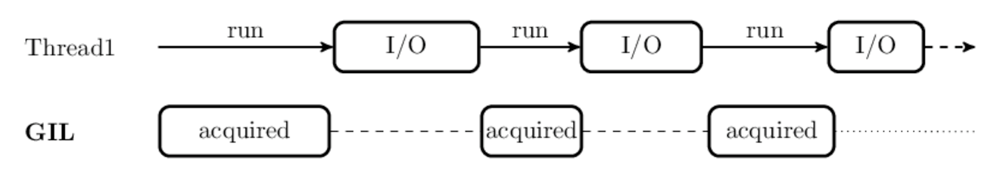
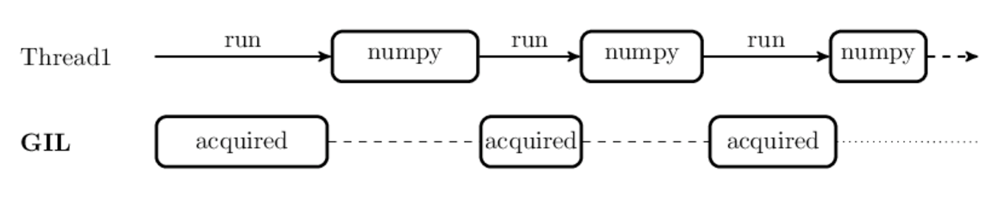

---
jupytext:
  text_representation:
    extension: .md
    format_name: myst
    format_version: '0.9'
    jupytext_version: 1.5.2
kernelspec:
  display_name: Python 3
  language: python
  name: python3
---

+++ {"slideshow": {"slide_type": "slide"}}

# High Performance Python

## This talk

1) Update on our 3 year [OCESE tlef](https://eoas-ubc.github.io/) for undergraduate education

2) An example jupyter-book: [Problem solving with python](https://phaustin.github.io/Problem-Solving-with-Python-37-Edition/)

3) Introduce the grad student/faculty/postdoc component being built at [eoas_python](https://github.com/eoas-ubc/eoas_python)

4) Next steps -- start a discussion about what high performance computing problem(s) you'd like to solve.  This discussion can occur via zoom chat today, pull requests on [eoas_python](https://github.com/eoas-ubc/eoas_python) and on the `#high-performance-python channel` in the [UBC datascience slack workspace](https://join.slack.com/t/ubc-datascience/signup)
   
5) Where we're heading: We want to offer  [grad courses like this](https://brian-rose.github.io/ClimateLaboratoryBook/courseware/climlab-intro.html) and increase your comfort level with the [pangeo tools](http://pangeo.io/packages.html) and accessing big data in the cloud.

+++ {"slideshow": {"slide_type": "slide"}}

# How to get started?

## Basic concepts (in rough order of acquisition)

0) Basic python/Jupyter notebooks/jupytext  (OCESE)  
1) The unix shell  (OCESE)  
2) git, github and open source collaboration  (OCESE)  
3) netcdf, xarray and zarr  (fast data access)  
4) timing and profiling  
5) joblib and dask  (concurrent and parallel code)  
6) numba, cython and pybind11 (speeding up hotspots)

+++ {"slideshow": {"slide_type": "slide"}}

# Essential concept: Threads and processes in Python

[Reference: Thomas Moreau and Olivier Griesel, PyParis 2017 [Mor2017]](https://tommoral.github.io/talks/pyparis17/#1)

+++ {"slideshow": {"slide_type": "slide"}}

# Motivation

1. Motivation: python objects (lists, dicts, sets, etc.) manage their own memory by storing a counter that keeps track of how many copies of an object are in use.  Memory is reclaimed when that counter goes to zero.

1. Having a globally available reference count makes it simple for Python extensions to create, modify and share python objects.

1. To avoid memory corruption, a python process will only allow 1 thread at any given moment to run python code.  Any thread that wants to access python objects in that process needs to acquire the global interpreter lock (GIL).

1. A python extension written in C, C++ or numba is free to release the GIL, provided it doesn't create, destroy or modify any python objects.  For example: numpy, pandas, scipy.ndimage, scipy.integrate.quadrature all release the GIL

+++ {"slideshow": {"slide_type": "slide"}}

# Motivation continued

1. Many python standard library input/output routines (file reading, networking) also release the GIL

1. On the other hand:  hdf5, and therefore h5py and netCDF4, don't release the GIL and are single threaded.

1. Python comes with many libraries to manage both processes and threads.

+++ {"slideshow": {"slide_type": "slide"}}

### Thread scheduling

If multiple threads are present in a python process, the python intepreter releases the GIL at specified intervals (5 miliseconds default) to allow them to execute:

#### Note that these three threads are taking turns, resulting in a computation that runs slightly slower (because of overhead) than running on a single thread

+++ {"slideshow": {"slide_type": "slide"}}

### Releasing the GIL

If the computation running on the thread has released the GIL, then it can run independently of other threads in the process.  Execution of these threads are scheduled by the operating system along with all the other threads and processes on the system.

In particular, basic computation functions in Numpy, like (\__add\__ (+), \__subtract\__ (-) etc. release the GIL, as well as universal math functions like cos, sin etc.

+++ {"slideshow": {"slide_type": "slide"}}

# Demo time
